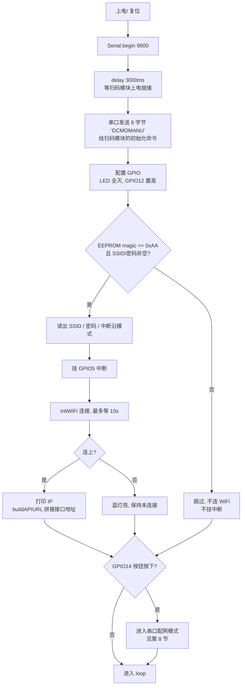
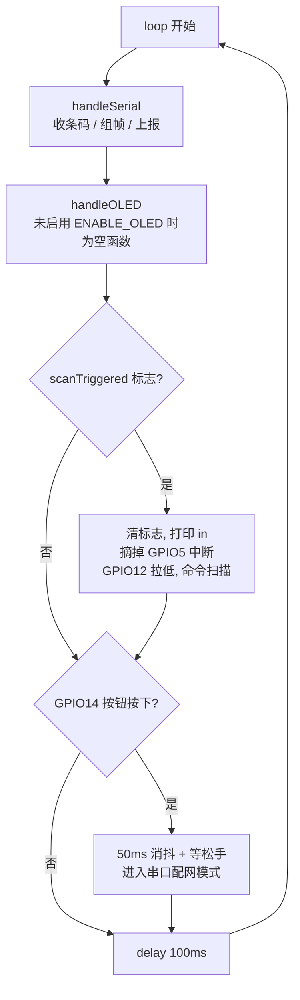
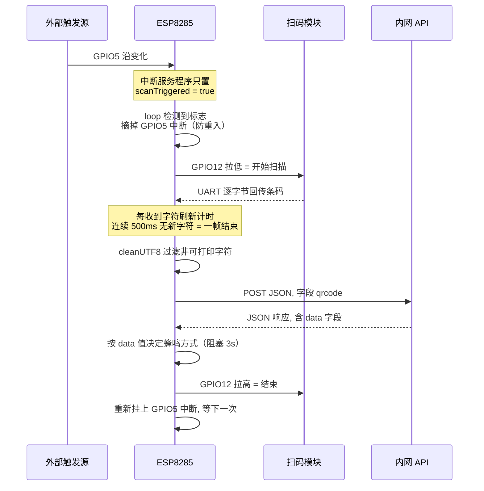
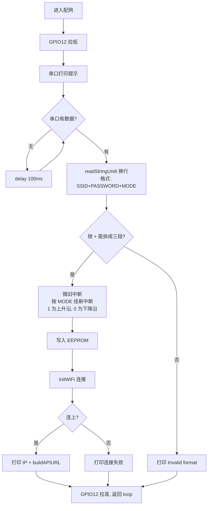

# ESP8285 物料盒扫码上报终端 — 控制流程

> 对应代码：`src/main.cpp`。本文描述固件的实际运行逻辑，`README.md` 仍是工程模板的内容，已与代码不符。

## 1. 系统定位

ESP8285 在这套系统里是**扫码模块与后台服务之间的桥**，本身不做业务判断，只负责搬数据和做现场提示。

```
   外部触发源                                              内网 API 服务
  (传感器/按钮)                                          x.x.x.96 : 90|92
        │                                                       ▲   │
        │ GPIO5 中断                                    HTTP POST│   │JSON
        ▼                                                       │   ▼
   ┌─────────────────────────────────────────────────────────────────┐
   │                          ESP8285                                │
   └─────────────────────────────────────────────────────────────────┘
        │ GPIO12 拉低触发            ▲ UART 条码            │
        ▼                            │                      ▼
   ┌──────────────────────────────────────┐        GPIO13 蜂鸣器
   │            扫码模块                   │        GPIO4/GPIO2 双色 LED
   └──────────────────────────────────────┘        GPIO14 配网按钮
```

一次业务动作：外部信号表示"有物料盒到位" → 命令扫码模块扫描 → 收到条码 → 上报后台 → 后台返回一个数值 → 用蜂鸣器把判定结果反馈给现场人员。

## 2. 硬件接口

| 引脚 | 方向 | 用途 | 有效电平 |
| --- | --- | --- | --- |
| GPIO5 | 输入上拉 | 外部"请求扫码"信号，触发中断 | 沿触发，上升/下降可配 |
| GPIO12 | 输出 | 触发扫码模块开始扫描 | 拉低触发，扫完回高 |
| GPIO13 | 输出 | 蜂鸣器 | 高电平响 |
| GPIO4 | 输出 | 绿灯（WiFi 已连接） | 低电平点亮 |
| GPIO2 | 输出 | 蓝灯（WiFi 未连接） | 低电平点亮 |
| GPIO14 | 输入上拉 | 配网按钮 | 拉低触发 |
| UART0 | 双向 | 9600 8N1，收条码 / 发调试日志 / 收配网命令 | — |

> UART0 是复用的：条码从 RX 进来，调试日志和配网提示从 TX 出去，而 TX 通常就接在扫码模块上。ESP8285 只有一个硬串口，这是设计上的妥协。

## 3. 上电初始化 (setup)



关键分支：**EEPROM 里没有有效配置、且上电时没按住按钮**，则中断没挂上、WiFi 也没连，设备处于空转状态 —— 外部触发不会有任何反应，必须按一次按钮进配网。

## 4. 主循环 (loop)



循环周期约 100ms。HTTP 请求（最多重试 1 次，每次间隔 1s）和蜂鸣器提示（3s，阻塞）都在 `handleSerial` 里同步执行，期间主循环停住，按钮和新的扫码触发都不会被处理。

## 5. 扫码上报完整时序

这是系统的核心链路，一次触发到一次反馈的全过程：



中断在扫码期间被摘掉，处理完才重新挂上，这样一次扫码过程中的重复触发信号会被忽略。

## 6. 串口数据组帧

条码是逐字节到达的，固件用**空闲超时**判断一帧结束，没有依赖结束符：

```
收到字符 c
  ├── 距上次收字符 > 500ms ? → 先清空 buffer（丢弃上一帧残留）
  ├── buffer += c
  ├── 串口回打 "Received char: 0x??"
  └── 刷新 lastReceiveTime

buffer 非空 且 距上次收字符 > 500ms
  ├── sendToAPI(buffer)
  ├── 清空 buffer
  ├── GPIO12 拉高
  └── 重新挂 GPIO5 中断      ← 无论上报成功与否都执行
```

超时常量 `TIMEOUT_MS = 500`。组帧不区分数据来源，而配网模式下又是阻塞读同一个串口，所以**配网期间扫码模块吐出的任何数据都会被当成配网命令读走**。

## 7. API 交互

### 地址是运行时拼出来的

设备不存服务器地址，而是从自己拿到的 DHCP 地址推算（`buildAPIURL`）：

```
取本机 IP 前三段 + 固定末位 96
端口：默认 90，若本机 IP 第三段 == 2 则用 92

例：本机 192.168.1.37  →  http://192.168.1.96:90/api/externalinterface/addMaterialBoxScanningRecord
    本机 192.168.2.37  →  http://192.168.2.96:92/api/externalinterface/addMaterialBoxScanningRecord
```

前提是**服务器必须和设备在同一个 /24 网段、且固定占用 .96**。换网段或改服务器 IP 都要改代码重新烧录。

### 请求与重试

```
最多尝试 2 次，失败间隔 1000ms
Content-Type: application/json
Body: {"qrcode":"<过滤后的条码>"}
```

过滤规则 `cleanUTF8`：只保留 ASCII 32–126 的可打印字符，其余全部丢掉。

判定"成功"的条件是 `httpCode > 0`，也就是**只要 TCP 层拿到了响应就算成功**，4xx / 5xx 不会触发重试。

### 响应解析与蜂鸣器判定

响应用 ArduinoJson 解析（`DynamicJsonDocument(1024)`），只看 `data` 一个字段，按数值大小决定提示音：

| `data` 取值 | 判定 | 蜂鸣行为 | 日志 |
| --- | --- | --- | --- |
| `0 <= data < 1` | 异常 | 连续长鸣 3 秒 | `Invalid data, buzzer 10s...` |
| `data >= 1` | 正常 | 间歇 3 声（响 0.5s / 停 0.5s） | `Valid data, buzzer 3s...` |
| `data < 0` | 走正常分支 | 间歇 3 声 | `Valid data, buzzer 3s...` |
| 无 `data` 字段 / 解析失败 | 不判定 | 不响 | 无 |

阈值来自常量 `OUTTIME = 1`。注意负值落到了"正常"分支，日志文案里的 "10s" 也与实际 3s 不符。

## 8. 配网流程

两个入口：上电时按住 GPIO14，或运行中按一下 GPIO14（会等按钮松开后才进入）。



配网命令格式：

```
MyWiFi+password123+0
```

约束：SSID 不能为空、密码不能为空、**密码里不能含 `+`**（用 `indexOf` 找前两个 `+` 切分）。等待输入是无超时阻塞的 —— 一旦进入配网模式，不输入任何东西设备就一直停在这里，扫码功能完全停摆。

配网成功后会立刻连一次 WiFi 并重算 API 地址，不需要重启。

## 9. EEPROM 存储布局

`EEPROM.begin(512)`，实际用掉前 98 字节：

| 地址 | 长度 | 内容 |
| --- | --- | --- |
| 0 | 1 | 魔术字 `0xAA`，标记配置有效 |
| 1 | 1 | 中断沿模式：`1` = 上升沿，`0` = 下降沿 |
| 2 – 33 | 32 | SSID，不足补 `0x00` |
| 34 – 97 | 64 | 密码，不足补 `0x00` |

读取时先校验魔术字，再要求 SSID 和密码都非空，任一条件不满足就视为"未配置"。

## 10. 状态指示对照

| 状态 | 绿灯 GPIO4 | 蓝灯 GPIO2 |
| --- | --- | --- |
| 刚上电（未连接判定前） | 灭 | 灭 |
| WiFi 已连接 | **亮** | 灭 |
| WiFi 连接失败 | 灭 | **亮** |

LED 只在 `initWiFi()` 里更新，运行中掉线不会改变灯的状态。

## 11. 边界情况与已知问题

按影响程度排列：

**扫码无结果会永久卡死。** GPIO5 触发后固件会摘掉中断并把 GPIO12 拉低，恢复动作全部挂在"串口收到数据并组帧完成"这一条路径上。如果扫码模块始终没吐出任何字节（没扫到码、模块故障、接线松），`inputBuffer` 一直为空，组帧超时分支不会执行，于是 GPIO12 永远保持低、中断永远不挂回来。此后设备对外部触发完全无响应，只能按按钮或复位。缺一条扫码超时恢复逻辑。

**`wifiConnected` 只会被置 true，不会被清零。** `initWiFi()` 失败时只改 LED，不复位这个标志。所以"先连上过、后来重新配网失败"的情况下标志仍为 true，`sendToAPI` 会带着旧的 `API_URL` 继续发请求。

**条码内容没做 JSON 转义。** payload 是字符串拼接的 `{"qrcode":"..."}`，而 `cleanUTF8` 保留了 ASCII 32–126，其中包含 `"` 和 `\`。条码里出现这两个字符就会破坏 JSON 结构，后台解析失败。

**中文条码会被整个丢掉。** `cleanUTF8` 过滤掉所有非 ASCII 字节，含中文的条码上报出去会变成空串或残缺内容。

**HTTP 错误码不重试。** 判定条件是 `httpCode > 0`，4xx/5xx 都算成功并直接返回，重试机制只对连接失败生效。

**没有掉线检测和重连逻辑。** 运行中 WiFi 断开时，`wifiConnected` 和 LED 都不会更新，能否恢复完全依赖 SDK 的自动重连。

**蜂鸣提示阻塞主循环 3 秒。** `buzzerBeep` / `buzzerBeepAlway` 都是 `delay` 死等，期间按钮和新的扫码触发都不会被处理。（用的是 `delay` 而非忙等，喂狗正常，不会 WDT 复位。）

**未配置状态下完全无响应。** EEPROM 没有有效配置时不挂中断，外部触发不产生任何动作，也没有任何提示告诉现场这是"需要配网"而不是"坏了"。

**串口是共用的。** 每个收到的字节都会以 hex 回打到 TX，而 TX 通常接着扫码模块；配网时 SSID 和密码也是明文打印。

**OLED 分支目前不可用。** 打开 `ENABLE_OLED` 需要 U8g2 库，但 `platformio.ini` 的 `lib_deps` 里没有；且代码里 OLED 用的 SCL/SDA 就是 GPIO12/GPIO14，与扫码触发和按钮冲突（源码注释已说明这点）。

**残留代码。** `interruptCount`（自增已注释）、`lastDebugPrint`、`apiSent`（仅 OLED 分支读取）目前都没有实际作用；`ALARM_PIN` 的 `pinMode` 只在蜂鸣函数内部设置，`setup()` 里没有初始化。

## 附：代码位置索引

| 功能 | 函数 | 位置 |
| --- | --- | --- |
| 拼接 API 地址 | `buildAPIURL` | [main.cpp:45](src/main.cpp:45) |
| 中断服务程序 | `onScanInterrupt` | [main.cpp:83](src/main.cpp:83) |
| WiFi 连接 | `initWiFi` | [main.cpp:89](src/main.cpp:89) |
| 字符过滤 | `cleanUTF8` | [main.cpp:108](src/main.cpp:108) |
| 上报与重试 | `sendToAPI` | [main.cpp:120](src/main.cpp:120) |
| 间歇蜂鸣 | `buzzerBeep` | [main.cpp:201](src/main.cpp:201) |
| 连续蜂鸣 | `buzzerBeepAlway` | [main.cpp:212](src/main.cpp:212) |
| 配置存取 | `saveConfigToEEPROM` / `loadConfigFromEEPROM` | [main.cpp:224](src/main.cpp:224) |
| 串口配网 | `connectWiFiFromSerial` | [main.cpp:260](src/main.cpp:260) |
| 串口组帧与上报 | `handleSerial` | [main.cpp:324](src/main.cpp:324) |
| 初始化 | `setup` | [main.cpp:392](src/main.cpp:392) |
| 主循环 | `loop` | [main.cpp:446](src/main.cpp:446) |


